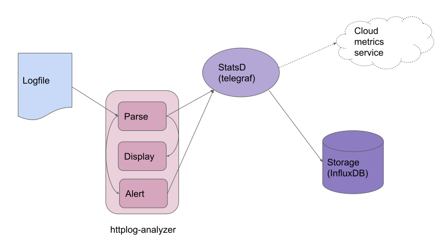

# httplog-analyzer

Analyze http logs tailing a file and showing metrics about the different parameters.

Current implementation only works with w3c-formatted HTTP access log (https://www.w3.org/Daemon/User/Config/Logging.html) , but is easy to add new logs format implementing the interface:

```go
// LogParser parse lines and sends stats to a Statsd server
type LogParser interface {
	LogParse(c *statsd.Client, line string) error
}
```

The corresponding code is in the file [logparse.go](logparse.go).

## Architecture

The monitoring system is based in 3 components:



* *httplog-analyzer*

1. parse the logs and sends the metrics to a statsd daemon.

2. show metrics in the console querying the data stored in InfluxDB.

3. alerts based on teh rate of request per seconds received.

* *telegraf*: StatsD collector that send the data to InfluxDB.

* *InfluxDB*: time series database that stores the data.


## Install

You can install the *httplog-analyzer* using `go build` or with the docker image provided.

You need to provide a StatsD collector and a storage, in this case we are going to use *telegraf* and *InfluxDB*.

You have to enable the StatsD Input plugin in *telegraf*, you can find an example configuration [in the demo folder](demo/telegraf/telegraf.conf).


## How to use it

The log analyzer is parametrizable with these options:

```sh
./httplog-analyzer -h
flag needs an argument: -h
Usage of ./httplog-analyzer:
  -f string
        log file (default "/tmp/access.log")
  -i string
        InfluxDB server address (default "http://127.0.0.1:8086")
  -h string
        help
  -s string
        Statsd server address (default "127.0.0.1:8125")
  -t int
        Threshold requests per second averaged over a 2 minutes slot (default 10)
```

If you don't have installed all the components, you can run a demo using docker.

1. Make sure you have installed [docker](https://docs.docker.com/install/) and [docker compose](https://docs.docker.com/compose/) and clone this repository.


2. From the root of the repository run the docker-compose file:

```sh
docker-compose -f demo/docker-compose.yaml up
```

3. Once docker-compose created all the containers you have your metrics infrastructure ready to go, just build and launch the log analyzer and observe the results in the console.

*NOTE:* If you don't have a log file you can create a fake one with [flog](https://github.com/mingrammer/flog)

```sh
go build
./httplog-analyzer -f /var/log/httpd/access.log
```


## UI

You can install Grafana to consume the data stored in InfluxDB, just configure it to [use InfluxDB in Grafana as data source](https://grafana.com/docs/grafana/latest/features/datasources/influxdb/).

## Extensions

*httplog-analyzer* can work with any StatsD daemon, per example, you can replace *telegra* and *InfluxDB* and use the [Datadog agent](https://docs.datadoghq.com/developers/dogstatsd/?tab=go#how-it-works) or any other system that is able to consume StatsD data and see the data on those services.

Another option is configuring *telegraf* to send metrics to another service, i.e., enabling the following section in *telegraf.conf* allows you to visualize your metrics locally and using the [Datadog service](https://www.datadoghq.com/):

```
# # Configuration for DataDog API to send metrics to.
# [[outputs.datadog]]
#   ## Datadog API key
#   apikey = "my-secret-key" # required.
#
#   # The base endpoint URL can optionally be specified but it defaults to:
#   #url = "https://app.datadoghq.com/api/v1/series"
#
#   ## Connection timeout.
#   # timeout = "5s"
```