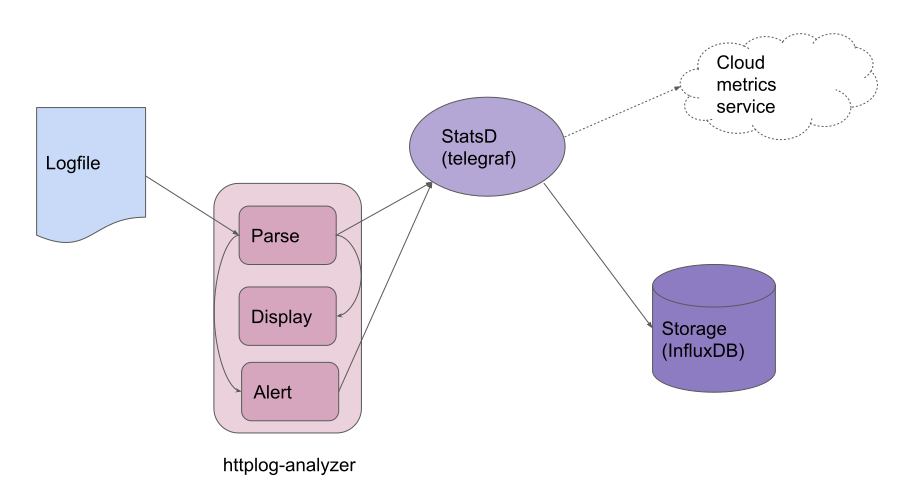
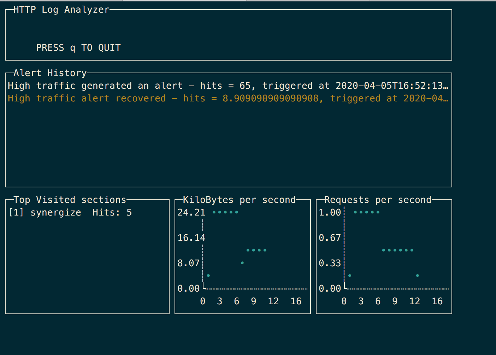

# httplog-analyzer

*httplog-analyzer* analyzes http logs tailing a file and showing metrics about the different parameters.

## Architecture

The *httplog-analyzer* has the following architecture, based on 3 components:



* *httplog-analyzer*: CLI tool, it

   * parses the logs and sends the metrics to a statsd daemon.

   * shows metrics in the console querying the data stored in InfluxDB.

   * alerts based on the rate of request per seconds received.

* *telegraf*: StatsD collector that send the data to InfluxDB.

* *InfluxDB*: time series database that stores the data.

## Install

You can install the *httplog-analyzer* using `go build` or usingthe binary corresponding to your OS from the folder *bin/httplog-analyzer.OSNAME*

You need to provide a StatsD collector and a storage for the metrics, in this case we are going to use *telegraf* and *InfluxDB*.

You have to enable the StatsD Input plugin in *telegraf*, you can find an example configuration [in the demo folder](demo/telegraf/telegraf.conf).

## How to use it

The log analyzer is parametrizable with the following options:

```sh
bin/httplog-analyzer.Linux -h

flag needs an argument: -h
Usage of bin/httplog-analyzer.Linux:
  -f string
        log file (default "/tmp/access.log")
  -h string
        help
  -i string
        InfluxDB server address (default "http://127.0.0.1:8086")
  -s string
        Statsd server address (default "127.0.0.1:8125")
  -t int
        Threshold requests per second averaged over a 2 minutes slot (default 10)
```

If you don't want to install the *telegraf* and *InfluxDB* components, the *demo/* automates its installation using docker.

1. Make sure you have installed [docker](https://docs.docker.com/install/) and [docker compose](https://docs.docker.com/compose/).

2. There is a docker-compose file that automates the installation of the all necessary components, in order to run it just type:

```sh
docker-compose -f demo/docker-compose.yaml up
```

3. Once docker-compose finish creating all the containers, you have your metrics infrastructure ready to go, just launch the log analyzer and observe the results in the console.

*NOTE:* If you don't have a log file you can create a fake one with [flog](https://github.com/mingrammer/flog)

```sh
# Build the binary
go build
# Create a fake log at a rate 1 log per second
flog -f apache_common -o /tmp/test.log -t log -l -w -d 1
# Start the log analyzer
./httplog-analyzer -f /var/log/httpd/access.log
```

You should obtain something like this in your console:



## UI

You can install Grafana to consume the data stored in InfluxDB, just configure it to [use InfluxDB in Grafana as data source](https://grafana.com/docs/grafana/latest/features/datasources/influxdb/).

The current demo installs a *Grafana* instance accessible in the following URL http://localhost:3000

## Extensions

You can configure *telegraf* to send metrics to another service or forward to another StatsD daemon like the [Datadog agent](https://docs.datadoghq.com/developers/dogstatsd/?tab=go#how-it-works), enabling the following section in *telegraf.conf* allows you to visualize your metrics locally and using the [Datadog service](https://www.datadoghq.com/):

```
# # Configuration for DataDog API to send metrics to.
# [[outputs.datadog]]
#   ## Datadog API key
#   apikey = "my-secret-key" # required.
#
#   # The base endpoint URL can optionally be specified but it defaults to:
#   #url = "https://app.datadoghq.com/api/v1/series"
#
#   ## Connection timeout.
#   # timeout = "5s"
```

## Development

Current implementation only works with w3c-formatted HTTP access log (https://www.w3.org/Daemon/User/Config/Logging.html), but is easy to add new logs format implementing the interface:

```go
// LogParser parse lines and sends stats to a Statsd server
type LogParser interface {
	LogParse(c *statsd.Client, line string) error
}
```

The corresponding code is in the file [logparse.go](logparse.go).
